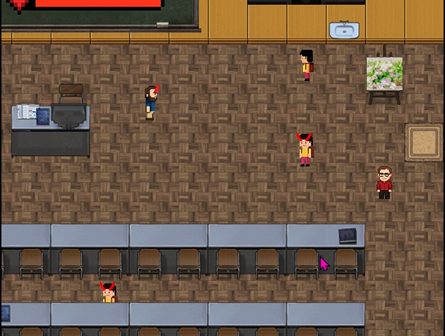

# ISC_Section-Manager

## 🎮 Description

*ISC – Section Manager* est un jeu 2D développé en Scala avec GDX2D. Vous incarnez un "héro" AKA Mr. MUDRY ,chargé de remettre de l'ordre dans la classe 21N307... en criant sur les mauvais élèves et les professeurs perturbateurs.

Attention cependant : tous les PNJ ne sont pas vos ennemis. Attaquer les gentils vous fait perdre des points !

---

## 📖 Manuel du jeu

### 🎯 Objectif
- Réprimander les mauvais élèves et professeurs en leur criant dessus.
- Éviter de blesser les PNJ gentils.
- Survivre le plus longtemps possible en gérant votre barre de vie.
- Accumuler un maximum de points en éliminant les ennemis.

### 🎮 Contrôles

| Action                | Touche               |
|-----------------------|----------------------|
| Déplacement haut      | `W` ou `↑`           |
| Déplacement bas       | `S` ou `↓`           |
| Déplacement gauche    | `A` ou `←`           |
| Déplacement droite    | `D` ou `→`           |
| Attaquer (crier)      | `Espace` ou `Entrée` |

### ❤️ Vie & Score

- Vous commencez avec une **barre de vie**.
- Chaque coup reçu par un ennemi vous fait perdre de la vie.
- Attaquer un ennemi rapporte des points.
- Attaquer un PNJ gentil fera perdre des points.

##  Demo

<video width="720" height="720" controls>
<source src="ISC-SM_gameplay_video.mp4" type="video/mp4">
</video>

